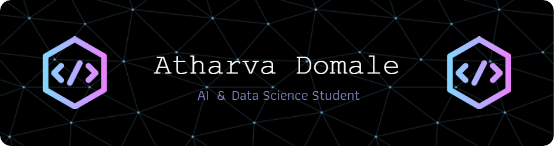

# Hi there, I'm Atharva! 👋

## About Me 🚀

AI-focused 3rd-year student with a strong foundation in ML algorithms, deep learning, ANN, Java, DSA, Linux, and AI. Proficient in Python, R, and AI frameworks like TensorFlow, Keras, and PyTorch. Completed several AI projects. Seeking internships and entry-level opportunities to apply my AI skills and grow as a professional. Eager to collaborate, learn, and make a positive impact in the field. Connect with me to discuss potential opportunities.
- 🌱 Currently learning: **AI,Deep Learning,Machine Learning**
- 🔭 Working on: **Sign Language Recognition project**
- 📫 How to reach me: )
                       

- ⚡ Fun fact: **My days are spent teaching machines to outsmart people (shh, don't tell them).**

<h3 align="left">Languages and Tools:</h3>

  
  
  
  
  
  
  
  
  
  
  
  
  
  
  
  

## Get in Touch 📬

- **[LinkedIn]**(https://www.linkedin.com/in/atharvadomale/)

