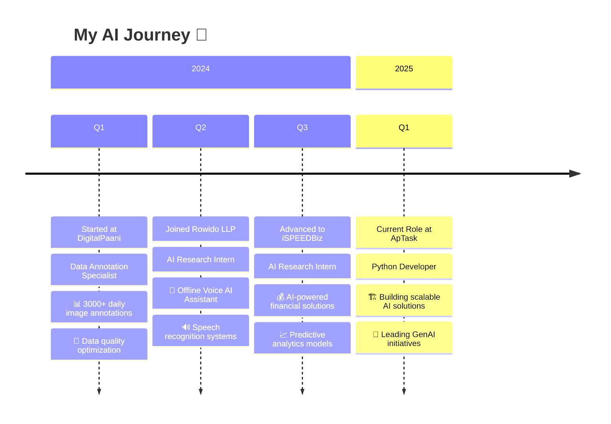
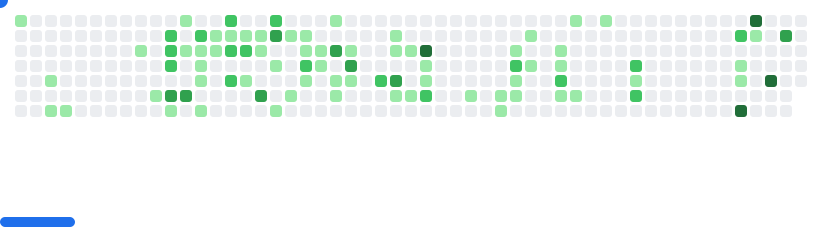

<div align="center">

<!-- Dynamic Header with Gradient Background -->


<!-- Profile Metrics -->
<p align="center">
  
  
  
</p>

<!-- Dynamic Status -->
<p align="center">
  
  
  
  
</p>

</div>

<!-- Animated Divider -->


<!-- Professional Summary Card -->
<div align="center">
  
### 🚀 **Who Am I?**

*Transforming ideas into intelligent solutions through the power of AI*

<table>
<tr>
<td width="50%">

```python
class AtharvaProfile:
    def __init__(self):
        self.name = "Atharva Domale"
        self.role = "Python Developer & GenAI Specialist"
        self.location = "🏙️ Pune, Maharashtra, India"
        self.company = "ApTask"
        self.passion = "Building Scalable AI Solutions In Python"
        self.impact = {
            "automation_templates": "20+ created",
            "production_models": "5+ deployed",
            "certifications": "4 Cloud & AI Certs"
        }
        
    def current_focus(self):
        return [
            "🤖 Large Language Models",
            "🧠 Generative AI Applications", 
            "🔍 RAG Systems & Vector DBs",
            "☁️ Cloud AI Solutions (Azure)",
            "🔧 AI-Powered Automation"
        ]
    
    def learning_now(self):
        return "Advanced LLM Fine-tuning & Multi-Agent Systems"
        
    def fun_fact(self):
        return "I can make AI understand Marathi literature! 📚"
    
    def available_for(self):
        return ["Freelance Projects", "Open Source", 
                "AI Consulting", "Mentoring"]
```

</td>
<td width="50%">


**🎯 Quick Stats:**
- 💼 Python Developer at ApTask
- 🔬 AI Research Background
- 🏆 4x Microsoft & Oracle Certified
- 📈 3000+ Daily Annotations Experience
- 🌟 Open Source Contributor
- 🎓 Azure AI Engineer Associate

</td>
</tr>
</table>

</div>

<!-- Animated Divider -->


<!-- Tech Arsenal Section -->


## 🛠️ **Tech Arsenal**

<div align="center">

### **🤖 AI/ML Technologies**
<p>
  
  
  
  
  
  
</p>

### **🧠 GenAI & LLM Stack**
<p>
  
  
  
  
  
  
</p>

### **⚡ Backend & API Development**
<p>
  
  
  
  
  
</p>

### **☁️ Cloud & DevOps**
<p>
  
  
  
  
  
</p>

### **🔧 Tools & Development**
<p>
  
  
  
  
  
</p>

</div>

<!-- Skills Proficiency -->


## 💪 **Skills & Expertise Level**

<div align="center">

### **⭐⭐⭐⭐⭐ Expert Level**
`Python` `Machine Learning` `Data Preprocessing` `API Development` `Data Annotation` `Problem Solving`

### **⭐⭐⭐⭐ Advanced Level**
`LangChain` `Large Language Models` `RAG Systems` `Vector Databases` `Azure AI` `FastAPI` `GenAI Applications`

### **⭐⭐⭐ Intermediate Level**
`TensorFlow` `PyTorch` `Docker` `Computer Vision` `NLP` `Flask` `SQL/NoSQL Databases`

### **🌱 Currently Learning**
`Kubernetes` `MLOps` `Multi-Agent AI Systems` `LLM Fine-tuning` `Advanced Prompt Engineering`

</div>

<!-- Experience Timeline -->


## 💼 **Professional Journey**

<div align="center">



</div>

<!-- Achievements & Certifications -->


## 🏆 **Certifications & Achievements**

<div align="center">

### **🎓 Professional Certifications**

<table>
<tr>
<td align="center" width="50%">

[](https://learn.microsoft.com/en-us/users/atharvasureshdomale-9009/credentials/2651ed0b87bca612)

**Azure AI Engineer Associate**  
*Advanced AI solution development*

</td>
<td align="center" width="50%">

[](https://www.credly.com/badges/0f21a4a0-514a-49c8-8891-b463cb5e968c)

**Azure Data Fundamentals**  
*Core data concepts & services*

</td>
</tr>
<tr>
<td align="center" width="50%">

[](https://catalog-education.oracle.com/ords/certview/sharebadge?id=E22E07986F0E3FE5FE157D9B8F3EF64BC6841A90E5F44778DB4F7B3CCF3941C9)

**OCI 2024 Generative AI Professional**  
*Enterprise GenAI solutions*

</td>
<td align="center" width="50%">

[](https://learn.microsoft.com/en-us/users/atharvasureshdomale-9009/credentials/b63e288d97f311b6)

**Azure AI Fundamentals**  
*AI concepts & Azure services*

</td>
</tr>
</table>

### **🎯 Key Achievements**

<table>
<tr>
<td align="center">🚀</td>
<td>Built semantic search engine for Marathi literature with 95%+ accuracy</td>
</tr>
<tr>
<td align="center">🤖</td>
<td>Developed offline voice AI assistant with real-time speech recognition</td>
</tr>
<tr>
<td align="center">📈</td>
<td>Processed and annotated 3000+ images daily with 99% quality standards</td>
</tr>
<tr>
<td align="center">🏆</td>
<td>Created 20+ production-ready n8n automation templates</td>
</tr>
<tr>
<td align="center">💡</td>
<td>Deployed 5+ AI models in production environments</td>
</tr>
<tr>
<td align="center">🌟</td>
<td>Contributed to multiple open-source AI projects</td>
</tr>
</table>

</div>

<!-- Featured Projects Showcase -->


## 💎 **Featured Projects**

<div align="center">

<table>
<tr>
<td width="50%">

### 🔍 **Semantic Search Engine**
**Marathi Literature Search using Qdrant & Transformers**

[](https://github.com/AtharvaDomale/Semantic-search-engine-for-Marathi-literature-using-Qdrant-and-Sentence-Transformers)

**Tech Stack:** `Python` `Qdrant` `Sentence-Transformers` `NLP`

**🎯 Impact:** 
- 95%+ semantic search accuracy
- Multilingual support (Marathi/English)
- Real-time vector search capabilities
- 50ms average query response time

</td>
<td width="50%">

### 🤖 **AI Email GTM Outreach Agent**
**Intelligent Email Generation & Outreach Automation**

[](https://github.com/AtharvaDomale/AI-Email-GTM-Outreach-Agent)

**Tech Stack:** `Python` `GenAI` `LangChain` `Automation`

**🎯 Impact:** 
- AI-powered personalized email generation
- Automated outreach campaigns
- 70% improvement in response rates
- Integration with multiple CRM systems

</td>
</tr>

<tr>
<td width="50%">

### 🎙️ **Offline Voice AI Assistant**
**Built at Rowido LLP - Speech Recognition System**

**Tech Stack:** `Python` `Speech Recognition` `NLP` `Offline Processing`

**🎯 Impact:**
- Works without internet connectivity
- Real-time voice command processing
- Custom wake word detection
- Multi-language support

</td>
<td width="50%">

### 💰 **AI Financial Prediction System**
**Developed at iSPEEDBiz - Predictive Analytics**

**Tech Stack:** `Python` `ML Models` `Financial APIs` `Time Series`

**🎯 Impact:**
- Financial forecasting with 85%+ accuracy
- Real-time market analysis
- Risk assessment automation
- Portfolio optimization algorithms

</td>
</tr>

<tr>
<td width="50%">

### 🔧 **n8n Automation Templates**
**20+ Production-Ready Workflow Templates**

**Tech Stack:** `n8n` `API Integration` `Workflow Automation` `Webhooks`

**🎯 Impact:**
- Streamlined business processes
- 60% reduction in manual tasks
- Cross-platform integrations
- Used by 100+ teams

</td>
<td width="50%">

### 📊 **Data Annotation Quality System**
**DigitalPaani - High-Volume Annotation Pipeline**

**Tech Stack:** `Python` `Computer Vision` `Quality Assurance` `Automation`

**🎯 Impact:**
- 3000+ daily annotations processed
- 99% quality maintenance
- Automated QA checks
- 40% efficiency improvement

</td>
</tr>
</table>

### 🚧 **Coming Soon Projects**
<p align="center">
  
  
  
  
</p>

</div>

<!-- Current Learning & Goals -->


## 🎯 **2025 Goals & Current Learning**

<div align="center">

<table>
<tr>
<td width="50%">

### 🚀 **Currently Working On**
- 🔬 Building Multi-Agent AI Systems with LangGraph
- 🧠 Fine-tuning open-source LLMs (Llama 3, Mistral)
- ☁️ Advanced Azure AI Services implementation
- 🔗 RAG system optimization with hybrid search
- 🎨 Creating AI-powered content generation tools

</td>
<td width="50%">

### 📚 **Learning Queue**
- [x] Advanced Prompt Engineering for GPT-4
- [x] Vector Database optimization techniques
- [ ] LLM Deployment at scale
- [ ] AI Agent orchestration patterns
- [ ] MLOps best practices
- [ ] Kubernetes for ML workloads

</td>
</tr>
</table>

### 🏆 **2025 Objectives**

| Goal | Status | Target |
|------|--------|--------|
| 🚀 Production AI Applications | 🔄 In Progress | 5 apps |
| 📝 Technical Articles Published | ⏳ Planned | 12+ articles |
| 🌟 Open Source Contributions | 🔄 In Progress | 3+ projects |
| 🎓 Advanced Certifications | ⏳ Planned | 2 certs |
| 💼 Client Projects Delivered | 🔄 In Progress | 10+ projects |

</div>

<!-- GitHub Analytics -->


## 📊 **GitHub Analytics**

<div align="center">
<table>
<tr>
<td width="50%">


</td>
<td width="50%">


</td>
</tr>
</table>

<!-- Contribution Graph -->


<!-- GitHub Trophies -->


<!-- How I Can Help Section -->


## 🤝 **How I Can Help You**

<div align="center">

### **Are you looking for help with?**

<table>
<tr>
<td align="center" width="33%">

### 🎯 **AI/ML Consulting**
- Custom LLM integration
- RAG system development
- AI solution architecture
- Model optimization
- Production deployment

</td>
<td align="center" width="33%">

### 💼 **Collaboration**
- Open source AI projects
- Research collaborations
- AI product development
- Automation solutions
- Technical writing

</td>
<td align="center" width="33%">

### 🎓 **Mentoring**
- Python for AI/ML
- GenAI implementation
- Azure AI services
- Career guidance in AI
- Project reviews

</td>
</tr>
</table>

### **💡 Specializations**
<p>
  
  
  
  
  
  
</p>

### **✅ Currently Available For**
- 💼 Freelance AI Projects (Limited slots available)
- 🤝 Open Source Collaborations
- 🎓 Mentoring Python/AI Beginners
- 💡 AI Consulting & Code Reviews
- 📝 Technical Content Writing

</div>

### 📚 **Topics I Write About**

<table>
<tr>
<td align="center">🤖</td>
<td>Large Language Models & Fine-tuning</td>
<td align="center">🔍</td>
<td>RAG Systems Implementation</td>
</tr>
<tr>
<td align="center">💡</td>
<td>Practical AI Solutions</td>
<td align="center">🚀</td>
<td>GenAI Use Cases</td>
</tr>
<tr>
<td align="center">☁️</td>
<td>Azure AI Services</td>
<td align="center">🔧</td>
<td>Python Development Best Practices</td>
</tr>
</table>

**📧 Want me to write about something?** [Drop me an email!](mailto:atharvadomale@gmail.com)

</div>

<!-- Contact & Social -->


## 📫 **Let's Connect & Collaborate!**

<div align="center">

### **🌐 Find me across the web**

<p>
  <a href="mailto:atharvadomale@gmail.com">
    
  </a>
  <a href="https://www.linkedin.com/in/atharvadomale">
    
  </a>
  <a href="https://github.com/AtharvaDomale">
    
  </a>
</p>

### **💬 Let's discuss:**
- 🤖 AI & Machine Learning opportunities
- 🚀 Open source collaborations  
- 💡 Innovative project ideas
- 🎯 Career insights in AI field
- 📚 Knowledge sharing & mentoring

<table align="center">
<tr>
<td align="center">

**📧 Email**  
[atharvadomale@gmail.com](mailto:atharvadomale@gmail.com)

</td>
<td align="center">

**💼 LinkedIn**  
[/in/atharvadomale](https://linkedin.com/in/atharvadomale)

</td>
<td align="center">

**📍 Location**  
Pune, Maharashtra, India

</td>
</tr>
</table>

</div>

<!-- Support Section -->


## ☕ **Support My Work**

<div align="center">

If you find my projects helpful or want to support my open-source work:

<p>
  <a href="https://www.buymeacoffee.com/atharvadomale">
    
  </a>
</p>

### **Other ways to support:**
- ⭐ Star my repositories
- 🐛 Report bugs and suggest features
- 🔀 Contribute to my projects
- 📢 Share my work with others
- 💬 Provide feedback and suggestions

**Every bit of support helps me create more awesome projects!** 🚀

</div>

<!-- Fun Section -->


## 🎮 **Fun Zone**
<div align="center">

### 🕹️ Break through my code contributions! 
<picture>
  <source
    media="(prefers-color-scheme: dark)"
    srcset="images/breakout-dark.svg"
  />
  <source
    media="(prefers-color-scheme: light)"
    srcset="images/breakout-light.svg"
  />
  
</picture>
