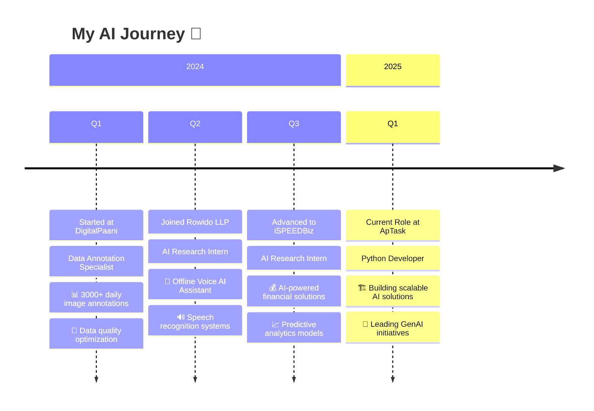

<div align="center">

<!-- Dynamic Header with Gradient Background -->


<!-- Profile Metrics -->
<p align="center">
  
  
  
</p>

<!-- Dynamic Status -->
<p align="center">
  
  
  
</p>

</div>

<!-- Animated Divider -->


<!-- Professional Summary Card -->
<div align="center">
  
### 🚀 **Who Am I?**

*Transforming ideas into intelligent solutions through the power of AI*

<table>
<tr>
<td width="50%">

```python
class AtharvaProfile:
    def __init__(self):
        self.name = "Atharva Domale"
        self.role = "AI Engineer & GenAI Specialist"
        self.location = "🏙️ Pune, Maharashtra, India"
        self.company = "ApTask"
        self.passion = "Building Scalable AI Solutions"
        
    def current_focus(self):
        return [
            "🤖 Large Language Models",
            "🧠 Generative AI Applications", 
            "🔍 RAG Systems & Vector DBs",
            "☁️ Cloud AI Solutions (Azure)",
            "🔧 AI-Powered Automation"
        ]
    
    def learning_now(self):
        return "Advanced LLM Fine-tuning & Multi-Agent Systems"
        
    def fun_fact(self):
        return "I can make AI understand Marathi literature! 📚"
```

</td>
<td width="50%">


**🎯 Quick Stats:**
- 💼 Python Developer at ApTask
- 🔬 AI Research Background
- 🏆 Microsoft Azure Certified
- 📈 3000+ Daily Annotations Experience
- 🌟 Open Source Contributor

</td>
</tr>
</table>

</div>

<!-- Tech Arsenal Section -->


## 🛠️ **Tech Arsenal**

<div align="center">

### **🤖 AI/ML Technologies**
<p>
  
  
  
  
  
  
</p>

### **🧠 GenAI & LLM Stack**
<p>
  
  
  
  
  
  
</p>

### **⚡ Backend & API Development**
<p>
  
  
  
  
  
</p>


### **☁️ Cloud & DevOps**
<p>
  
  
  
  
</p>

### **🔧 Tools & Development**
<p>
  
  
  
  
  
</p>

</div>

<!-- Experience Timeline -->


## 💼 **Professional Journey**

<div align="center">



</div>

<!-- Achievements & Certifications -->


## 🏆 **Achievements & Certifications**

<div align="center">
<table>
<tr>
<td width="50%" align="center">

### **🎓 Certifications**


</td>
<td width="50%" align="center">

### **🎯 Key Achievements**
- 🚀 Built semantic search for Marathi literature
- 🤖 Developed offline voice AI assistant
- 📈 Processed 3000+ annotations daily
- 🏆 Created 20+ n8n automation templates
- 💡 Contributed to open-source AI projects

</td>
</tr>
</table>
</div>

<!-- Featured Projects Showcase -->


## 💎 **Featured Projects**

<div align="center">

<table>
<tr>
<td width="50%">

### 🔍 **Semantic Search Engine**
**Marathi Literature Search using Qdrant & Transformers**

[](https://github.com/AtharvaDomale/Semantic-search-engine-for-Marathi-literature-using-Qdrant-and-Sentence-Transformers)

**Tech Stack:** `Python` `Qdrant` `Sentence-Transformers` `NLP`

🎯 **Impact:** Revolutionary search capabilities for Marathi literature with semantic understanding

</td>
<td width="50%">

### 🤖 **AI Email GTM Outreach Agent**
**Intelligent Email Generation & Outreach Automation**

[](https://github.com/AtharvaDomale/AI-Email-GTM-Outreach-Agent)

**Tech Stack:** `Python` `GenAI` `LangChain` `Automation`

🎯 **Impact:** AI-powered email outreach system for enhanced business communications

</td>
</tr>
</table>

### 🚧 **Coming Soon Projects**
<p align="center">
  
  
  
</p>

</div>

<!-- GitHub Analytics -->


## 📊 **GitHub Analytics**

<div align="center">
<table>
<tr>
<td width="50%">


</td>
<td width="50%">


</td>
</tr>
</table>

<!-- Contribution Graph -->


<!-- GitHub Trophies -->


</div>

<!-- Contact & Social -->


## 📫 **Let's Connect & Collaborate!**

<div align="center">

### **🌐 Find me across the web**

<p>
  <a href="mailto:atharvadomale@gmail.com">
    
  </a>
  <a href="https://www.linkedin.com/in/atharvadomale">
    
  </a>
  <a href="https://github.com/AtharvaDomale">
    
  </a>

</p>

### **💬 Let's discuss:**
- 🤖 AI & Machine Learning opportunities
- 🚀 Open source collaborations  
- 💡 Innovative project ideas
- 🎯 Career insights in AI field

<table align="center">
<tr>
<td align="center">

**📧 Email**  
[atharvadomale@gmail.com](mailto:atharvadomale@gmail.com)

</td>
<td align="center">


**💼 LinkedIn**  
[/in/atharvadomale](https://linkedin.com/in/atharvadomale)

</td>
</tr>
</table>

</div>

<!-- Fun Section -->


## 🎮 **Fun Zone**

<div align="center">

### **🐍 Watch my contributions get eaten!**
<picture>
  <source media="(prefers-color-scheme: dark)" srcset="https://raw.githubusercontent.com/AtharvaDomale/AtharvaDomale/output/github-contribution-grid-snake-dark.svg">
  <source media="(prefers-color-scheme: light)" srcset="https://raw.githubusercontent.com/AtharvaDomale/AtharvaDomale/output/github-contribution-grid-snake.svg">
  
</picture>

### **🎯 Profile Summary**


### **📈 Language Stats**


</div>

---

<div align="center">

### **💭 Random Dev Quote**


### **🎵 Currently Vibing To**
*"The sound of AI models training successfully..."* 🎧


**⭐ If you find my work interesting, don't forget to star my repositories!**

*"Building the future, one algorithm at a time."* 🚀

</div>
