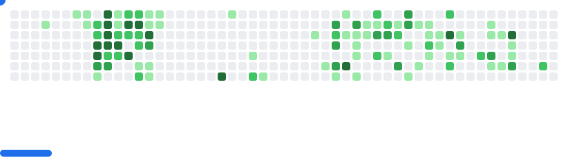

<div align="center">
  
  <!-- Animated Header - Using SVG for better visibility -->
  <h1>
    
  </h1>

  <!-- Profile Views Counter -->
  

  <!-- Professional Title -->
  <h3>
     
    AI Engineer | LLM & GenAI Specialist | Microsoft Azure Certified
  </h3>

</div>

<!-- Badges Section -->
<p align="center">
  <a href="mailto:atharvadomale@gmail.com">
    
  </a>
  <a href="https://www.linkedin.com/in/atharvadomale">
    
  </a>
</p>

<!-- Animated Separator -->


<!-- About Me Section -->
### 🚀 About Me

```python
class AtharvaProfile:
    def __init__(self):
        self.name = "Atharva Domale"
        self.role = "AI Engineer"
        self.location = "Pune, Maharashtra, India"
        self.skills = ["GenAI", "LLMs", "NLP", "ML/DL", "Full Stack AI"]
        self.tools = ["Python", "Flask", "FastAPI", "Next.js", "LangChain"]
        self.interests = ["AI Research", "Automation", "Innovation"]
        
    def get_current_work(self):
        return "Building scalable AI solutions at ApTask"
        
    def get_learning(self):
        return "Exploring advanced LLM architectures and RAG systems"
```

<!-- Tech Stack Section with Icons -->
### 🛠️ Tech Stack
<p align="center">
  
  
  
  
  
  
</p>

<!-- Certifications Section -->
### 🏆 Certifications
<details>
<summary>View Certifications</summary>
<br>

- 🌟 Microsoft Certified: Azure Fundamentals
- 🌟 Microsoft Certified: Azure Data Fundamentals
- 🌟 Foundation of Generative AI
- 🌟 Fundamentals of Deep Learning

</details>

<!-- Featured Projects Section -->
### 💻 Featured Projects
<div align="center">
  <a href="[https://github.com/AtharvaDomale/Semantic-search-engine-for-Marathi-literature-using-Qdrant-and-Sentence-Transformers.](https://github.com/AtharvaDomale/AI-Email-GTM-Outreach-Agent">
    
  </a>
  <a href="[https://github.com/AtharvaDomale/awesome-n8n-templates](https://github.com/AtharvaDomale/AI-Email-GTM-Outreach-Agent">
    
  </a>
</div>

<!-- Professional Experience Timeline -->
### 👨‍💻 Experience Timeline


<!-- GitHub Stats Section -->
### 📊 GitHub Statistics
<p align="center">
  
  
</p>

<!-- Dynamic Contribution Graph -->


<!-- Footer -->
<div align="center">
  
</div>

<!-- Dynamic Breakout Game Image -->
<p align="center">
<picture>
  <source
    media="(prefers-color-scheme: dark)"
    srcset="images/breakout-dark.svg"
  />
  <source
    media="(prefers-color-scheme: light)"
    srcset="images/breakout-light.svg"
  />
  
</picture>
</p>
